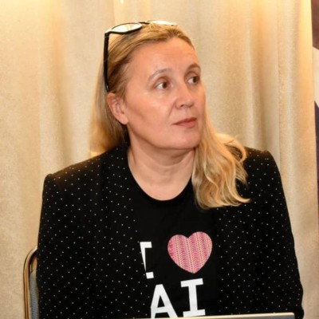
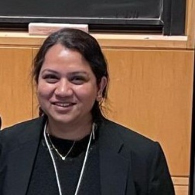
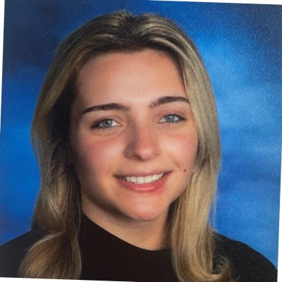

# Pace University AI Internship Experience 2025 

## Instructors

|  |  |
|:--:|:--:|
| **Dr. Christelle Scharff** | **Dr. Kaleema** |

## Graduate Assistant

|  |
|:--:|
| **Stephanie Sicilian** |

## Organizers

|  |  |
|:--:|:--:|
| **Jill Olimpieri** | **Rachel Schwartz** |

## Agenda

* [Agenda](https://bit.ly/aiie2025agenda)

## Slides & Google Colab Notebooks

* [Presentation of the Program (slides)](https://docs.google.com/presentation/d/1mXs8x03CNAjjxBTiG6ulTVpsa-6LVy1h/present)
* [Git / GitHub (slides)](https://docs.google.com/presentation/d/1QrUF5VkxmcPVTuK3uwPpu2BEuMMzvJUvMagqOTXlUpw/present)
* Review of Python
  * [Data Types Notebook](https://colab.research.google.com/drive/1G1_RV6o8__wldSdG9ebppcA6_IOIM0-k)
  * [Operators Notebook](https://colab.research.google.com/drive/1-xB1lUb_30c4ua7RdvYhWwd9dcUsVeWg)
  * [Control Statements Notebook](https://colab.research.google.com/drive/1ItP4wQYpvgdpkdtxn0jo4Qc_wJWxf1fU)
  * [Methods and Functions Notebook](https://colab.research.google.com/drive/159kQdFtvTqQIQmVrTNNgjY_XLBcFZfl7?usp=sharing)
  * [Classes](https://colab.research.google.com/drive/1K9eAaCONdEARKY0wu2kxGEKZMnYDKToa)
* Test your Python Skills with these Google Colab Notebooks
  * [Test your skills 1 Notebook](https://colab.research.google.com/drive/1of3ofPbaCMLLRGxYngXaK8NjqLXPeesS?usp=sharing)
  * [Test your skills 2 Notebook](https://colab.research.google.com/drive/1TaJ7gjhtNIvPNJDbJzJY6YBNRKJh_ndx?usp=sharing)
* Agile Methodologies
  * [Agile Methodologies & Scrum (slides)](https://docs.google.com/presentation/d/13GKbuR_8ylKtdVQJ2RFiif0dv7dr3BQLEpecwSXjbiM/present)
* Numpy and Pandas
  * [Numpy Notebook](https://colab.research.google.com/drive/1_6DqSqxVdTqlYMmWIfK-Qv2soZfKqknr)
  * [Pandas Notebook](https://colab.research.google.com/drive/1WkKzB-IYSTxEgcGgaYbVvisdtRjOsDjP)
  * [Pandas Notebook Practice](https://docs.google.com/document/d/1kJemEivhqu-ZUTUpCJWkvFJIM2zN0c3M/edit?usp=sharing&ouid=117718613427254641121&rtpof=true&sd=true)
* Images and Pillow
  * [Manipulating Images with Pillow Slides (slides)](https://docs.google.com/presentation/d/1_1a88EK0kytjKVKCC7S4VF2_4QpHQbSp1S1cubSvlRU/present)
  * [Manipulating Images with Pillow Notebook](https://bit.ly/imgfiltercolab)
* **First team project:** Google Tools
  * [Google Gemini for Students](https://gemini.google/students)
  * [Tool List and Assignment](https://docs.google.com/document/d/1cTK4GF2fc-lw-wU6Dl49xfqw6w55IzynnbGeP292ClI/edit?usp=sharing)
* Tall Tower Team Exercise
  * [Challenge Instructions (slides)](https://docs.google.com/presentation/d/1mS2YnVz2gEH-LoAqmwAdBE5Bc44whAdKmqRLyX0Tnb4/present)
* Machine Learning
  * Linear Regression
    * [Linear Regression (slides)](https://docs.google.com/presentation/d/15WdzPEqUXP6oBJ-UvsZiH_om8_jFqKxs/present)
    * [Linear Regression Notebook](https://drive.google.com/file/d/1Re9hytp7VzWhSEtj4g4CPOhIwSenazyx/view?usp=sharing)
  * CNN
    * [Neural Networks (slides)](https://docs.google.com/presentation/d/13iChhAaJHpvnZdknWBVhNG4VS4WY9Bxn/present)
    * [CNN (slides)](https://docs.google.com/presentation/d/1X6zsjnJya32G60dbkWGHsdN-KJZU1fvA/present)
    * [CNN Cat vs. Dog Classification Notebook](https://drive.google.com/file/d/1CgxWLSib_cb-inFlwgxB3MVEM5rcHPSB/view?usp=sharing) 
    * [MNIST Classification Notebook](https://colab.research.google.com/drive/1kPpaksyGzVHJ0EAvOjy_fTf51Ch8rN6c)
* **Second team project:** Classification
  * [Project presentation (slides)](https://docs.google.com/presentation/d/1WOlORtvljQqUyxUYM3u5oVcP9X7LotttIwVj8dy7Olc/present) 
* Introduction to Google Gemini 
  * [Overview of Google Gemini and Gen AI for Images (slides)](https://docs.google.com/presentation/d/1yW-halc0XC2pXHPp5BUBHt0vW3RQEx0L/present)
  * [Image Generation and Editing Notebook](https://colab.research.google.com/drive/1LHSK6SOlZHQVS6C626NGKAK9nV_x_qU1?usp=sharing)
  * [Video Understanding Notebook](https://colab.research.google.com/drive/1S1bHdXrueQFtiMxD8R99DBUbm0rwfqsY?usp=sharing)
  * [Text-to_Speech Notebook](https://colab.research.google.com/drive/1Ce1SMZhVx6hqdSkHpb8JMHQ0HOXaebC9?usp=sharing)
  * [Music Generation Notebook](https://colab.research.google.com/drive/1g9C-M-VHxyl2ftZYNHSAnkia4L8XXL53?usp=sharing)
* NLP
  * [Generative AI (slides)](https://docs.google.com/presentation/d/1Ax5MTiBuN5_w7qce1NU28Ka6XWUDKnZp/present)
  * [Text Sentiment Analysis Notebook](https://drive.google.com/file/d/17HvJAyxknig1nyvjEyBCo_9Alwc4Maty/view)
  * [Gemini for generating text Notebook](https://colab.research.google.com/drive/1hOHbYFJmTs-VftfiR-EkccWT_RmIVHX5)
  * [Gemini for summarization Notebook](https://colab.research.google.com/drive/1YYe133p0abq-wMhpBNwIkpBZDCfYfdGJ)
  * [Gemini for chatbot Notebook](https://colab.research.google.com/drive/1ikoOcNX1Zczmww2UJq5hg9thZPUt6Q4L?usp=sharing)
* Building a Chatbot with Gemini and Streamlit (by: Tejomay Kapadia, Rohan Niranjan Kalpavruksha, and Roshan Niranjan Kalpavruksha)
  * [Hackathon Slides](https://docs.google.com/presentation/d/1wn7dcAdNaRzQMnn7Qx6abGnBtwlntQY5/present)
  * [Hackathon Notebook](https://colab.research.google.com/drive/1TsICVxt0IbJ6_W11vHHu32s3duDJXV8U?usp=sharing)
* OpenAI Chatbot Notebooks
  * [Model for Querying Document](https://colab.research.google.com/drive/1mEIxOFtd3-09PjifnTa6_qwe1XiVTD0z?usp=sharing)
  * [Text-to-Image](https://colab.research.google.com/drive/1yHA_CinM1KUXxItohSlVCd1DJebv3nQi?usp=sharing)
  * [Conversational Agent](https://colab.research.google.com/drive/1M0Pq2ajXrHFjhrXGdDtY04IQxaB49BGs?usp=sharing)
* **Third team project:** Generative AI
  * [Project presentation (slides)](https://docs.google.com/presentation/d/1WOlORtvljQqUyxUYM3u5oVcP9X7LotttIwVj8dy7Olc/present) 
 
## Other Resources

  * [Datasets](https://catalog.data.gov/dataset)
  * [Google Gemini Cookbook](https://github.com/google-gemini/cookbook/tree/main)
  * [GitHub Education Teacher Toolbox](https://github.com/github-education-resources/teacher-toolbox?tab=readme-ov-file#user-content-curriculum)
  * [GitHub Education ML Course](https://microsoft.github.io/ML-For-Beginners/#/)
  * [GitHub Education Web Course](https://microsoft.github.io/Web-Dev-For-Beginners/#/)
